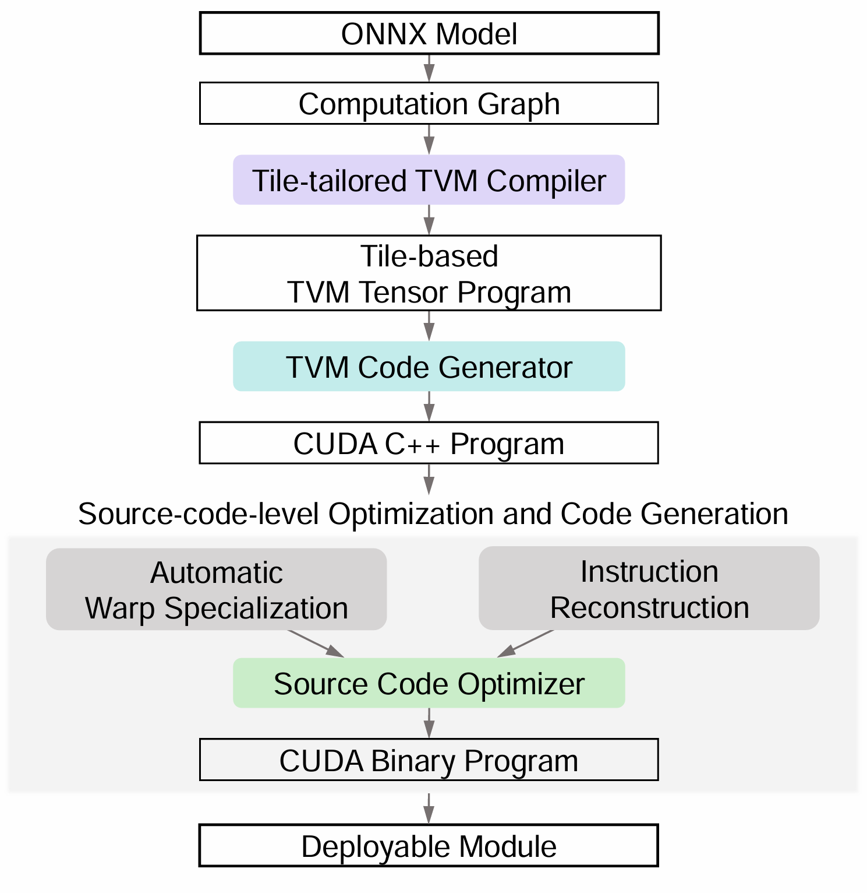
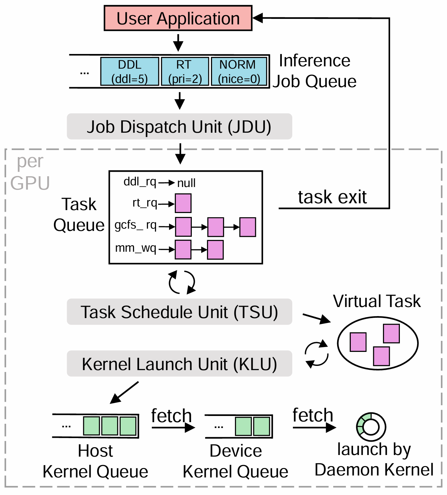

# Infera

Infera is a fine-grained scheduler for GPU sharing across ML workloads.
It is featured with an offline compiler and an online scheduler.
Infera currently supports NVIDIA GPUs.

The core of Infera is depicted as




## Project Structure
```
Infera
├── profiling                           # Scripts and instructions for profiling
├── kernel_generator              # Source code for tile-based compiler
├── inference_engine              # Source code for online scheduler
├── test                                    # Examples for running
└── 3rdparty                            # Third-party libraries

```


## Install
```
sudo ./compile.sh
```


## Run
Please refer to ```./test/example/README.md``` for runnable examples.